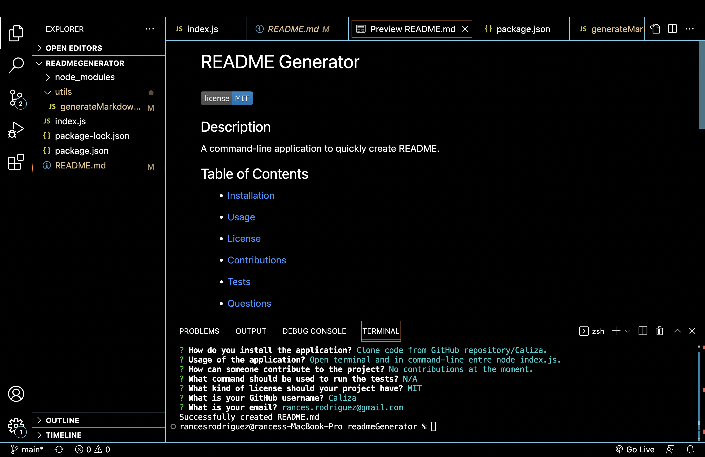

<h1>readmeGenerator</h1>

## Description

- Built a command-line application that accpets user input to quickly create professional README.
- Application prompts user with a list of questions in oreder to generate README. 
- After user answer questions, a README file will be created with users' responses.
- Learned how to use template literals and how to write a markdown file to create README using node.js.

## Usage

- Clone code from GitHub repository: https://github.com/Caliza/readmeGenerator. 
- Open in VS Code and open command-line terminal. 
- Type 'node index.js' in command-line to start application and anwser questions and select license to generate README.

## Links

https://github.com/Caliza/readmeGenerator

https://watch.screencastify.com/v/GFoupMLsYYDtBqA1itjf

https://drive.google.com/file/d/16VeQ6UqNdzh3bFfNWYt4Ao_vZ673145-/view?usp=sharing
    

    
## Email

rances.rodriguez@gmail.com